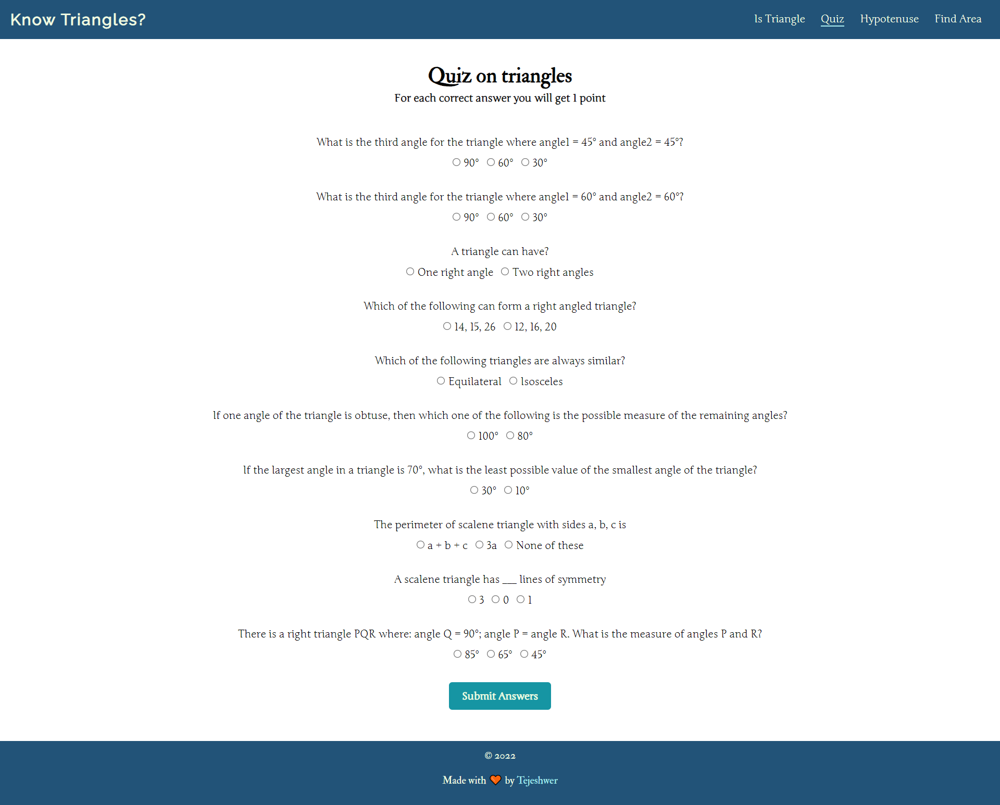
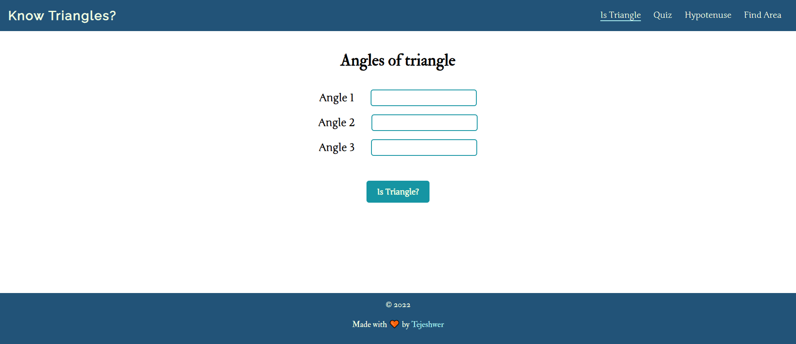
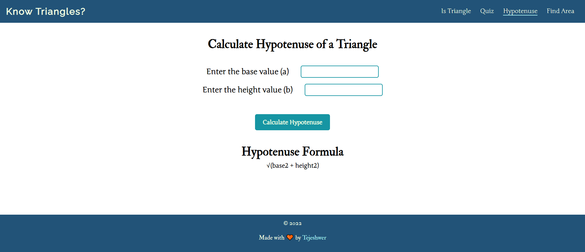
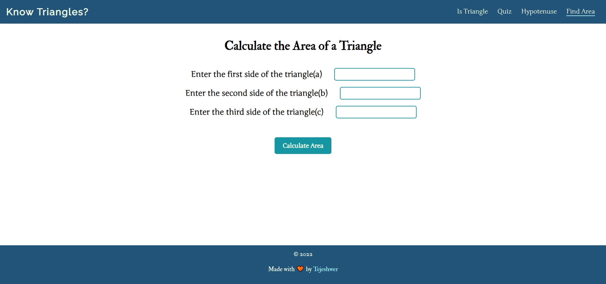

# knowTriangles_mark12

App to check your knowledge on triangles

## Live Project

[Link to live Project](https://know-triangles-mark12.netlify.app/)

## Preview

## Working

### Quiz Section

The Quiz section contains around 10 questions based on the concept of triangles. The questions are objective in nature, and for each correct answer the user is awarded 1 mark.

### Is Triangle Page

In this section the user is asked for 3 angles of the triangle. The app then checks whether or not a triangle can be formed from the given angles.
A triangle can only be formed if angle1 + angle2 + angle3 = 180.

### Hypotenuse Page

In this section the user is asked to enter the base and height of a right-angled triangle. The app then calculates the hypotenuse of the triangle using the respective formula.

### Find Area Page

In this section the user is asked to enter all the three sides of the triangle. The app then calculates the area of the triangle using Heron's Formula.

